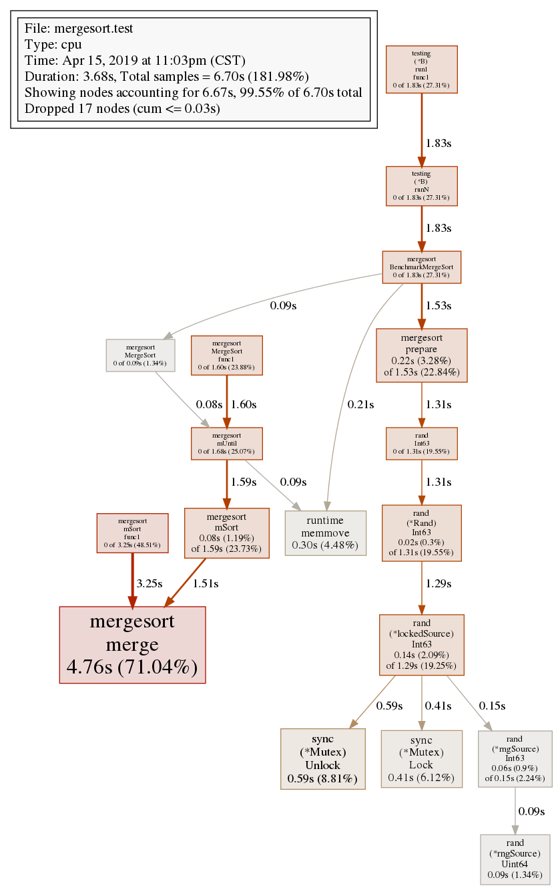
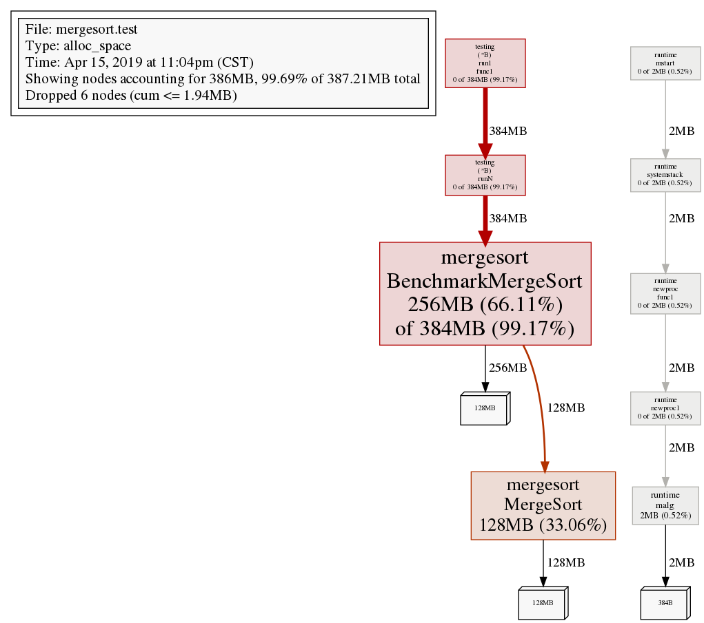
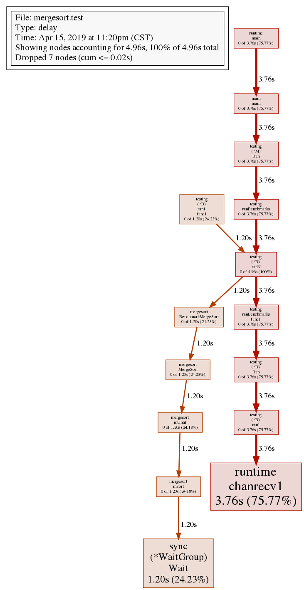
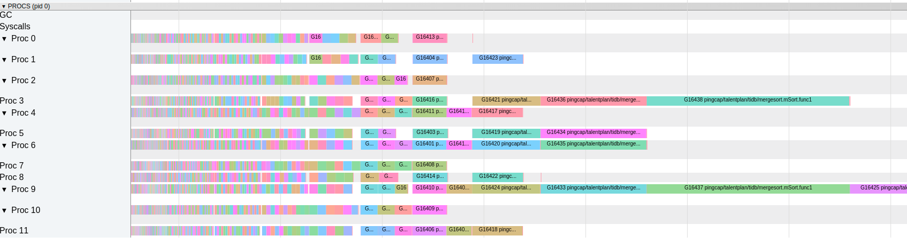

# TiDB Week1 并行归并排序 作业报告

我这里选择并行化非递归版的归并排序，而不是大多人选择的递归版并行排序。

## (30%) pass unit tests

```
go test
OK: 4 passed
OK: 4 passed
PASS
ok      pingcap/talentplan/tidb/mergesort       6.088s
```

## (20%) Performs better than `sort.Slice()`


```
go test -bench Benchmark -run xx -count 5 -benchmem
goos: linux
goarch: amd64
pkg: pingcap/talentplan/tidb/mergesort
BenchmarkMergeSort-12                  3         417465237 ns/op        134231312 B/op        48 allocs/op
BenchmarkMergeSort-12                  3         424518753 ns/op        134217904 B/op         4 allocs/op
BenchmarkMergeSort-12                  3         420922482 ns/op        134217744 B/op         2 allocs/op
BenchmarkMergeSort-12                  3         426840985 ns/op        134218138 B/op         8 allocs/op
BenchmarkMergeSort-12                  3         430672479 ns/op        134217978 B/op         5 allocs/op
BenchmarkNormalSort-12                 1        2841872752 ns/op              64 B/op          2 allocs/op
BenchmarkNormalSort-12                 1        2833237320 ns/op              64 B/op          2 allocs/op
BenchmarkNormalSort-12                 1        2837804320 ns/op              64 B/op          2 allocs/op
BenchmarkNormalSort-12                 1        2898135271 ns/op              64 B/op          2 allocs/op
BenchmarkNormalSort-12                 1        2906413253 ns/op              64 B/op          2 allocs/op
BenchmarkSortSort-12                   1        6003111254 ns/op              32 B/op          1 allocs/op
BenchmarkSortSort-12                   1        6277211359 ns/op              32 B/op          1 allocs/op
BenchmarkSortSort-12                   1        9970540218 ns/op              32 B/op          1 allocs/op
BenchmarkSortSort-12                   1        8499443049 ns/op              32 B/op          1 allocs/op
BenchmarkSortSort-12                   1        8736098911 ns/op              32 B/op          1 allocs/op
BenchmarkQuickSort-12                  1        5856028202 ns/op               0 B/op          0 allocs/op
BenchmarkQuickSort-12                  1        7374598766 ns/op               0 B/op          0 allocs/op
BenchmarkQuickSort-12                  1        7402083721 ns/op               0 B/op          0 allocs/op
BenchmarkQuickSort-12                  1        7456244493 ns/op               0 B/op          0 allocs/op
BenchmarkQuickSort-12                  1        7438559501 ns/op               0 B/op          0 allocs/op
PASS
ok      pingcap/talentplan/tidb/mergesort       116.703s

```

## (30%) Profile your program with `pprof`, analyze the performance bottleneck.

### cpu profile:



### mem profile:



### block profile



### trace




从trace可以看出前期程序充分利用了全部的CPU核，但是到了后期可能是因为
剩余的归并块已经不是很多,导致只有几个核在工作。后期的并发数还可以考虑继续提高。

## (10%) Have a good code style.

## (10%) Document your idea and code.

